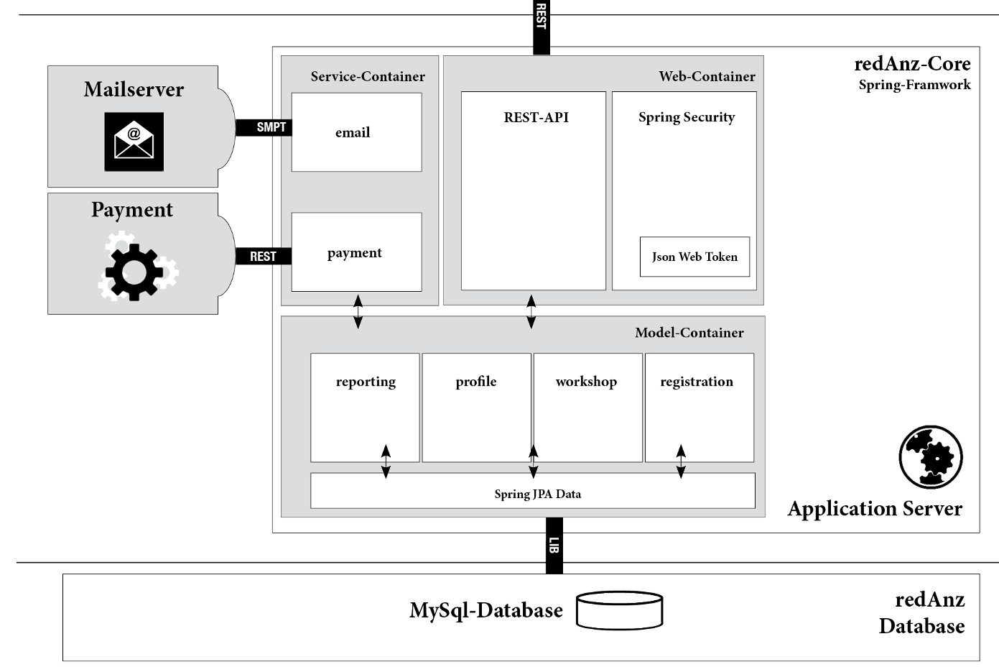

## redAnz Backend Model
Java Project MAS 2022 ZHAW Informatics 
[https://github.com/chrinc/redanz-Core.git]()

#### **Tools**
Tools used for testing and developement
- IntelliJ IDEA 2022.1.3 (Ultimate Edition)
- Postman Version 9.25.1
- Apache Freemarker

#### **Spring Boot / JDK / MySQL**
- Version: 2.6.7
- JDK Version: 17
- MySQL: Ver 8.0.30-0ubuntu0.22.04.1 for Linux on x86_64 ((Ubuntu))

#### **redAnz Model Containers**
- Model Container: Business Logics reporting, profile, workshop, registration
- Service Container: Interface for email & payment handling
- Web-Container: Frontend REST and Security Handling

